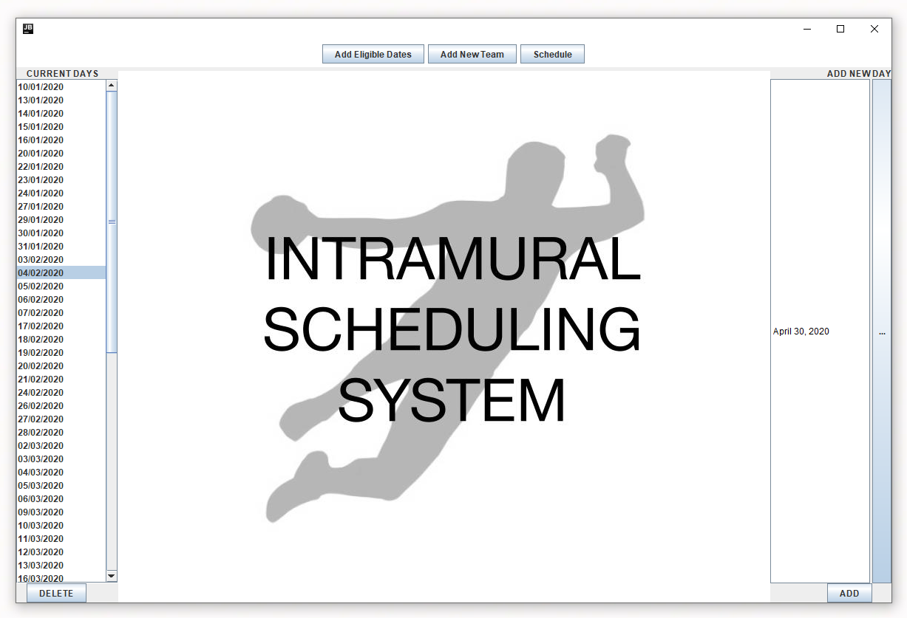
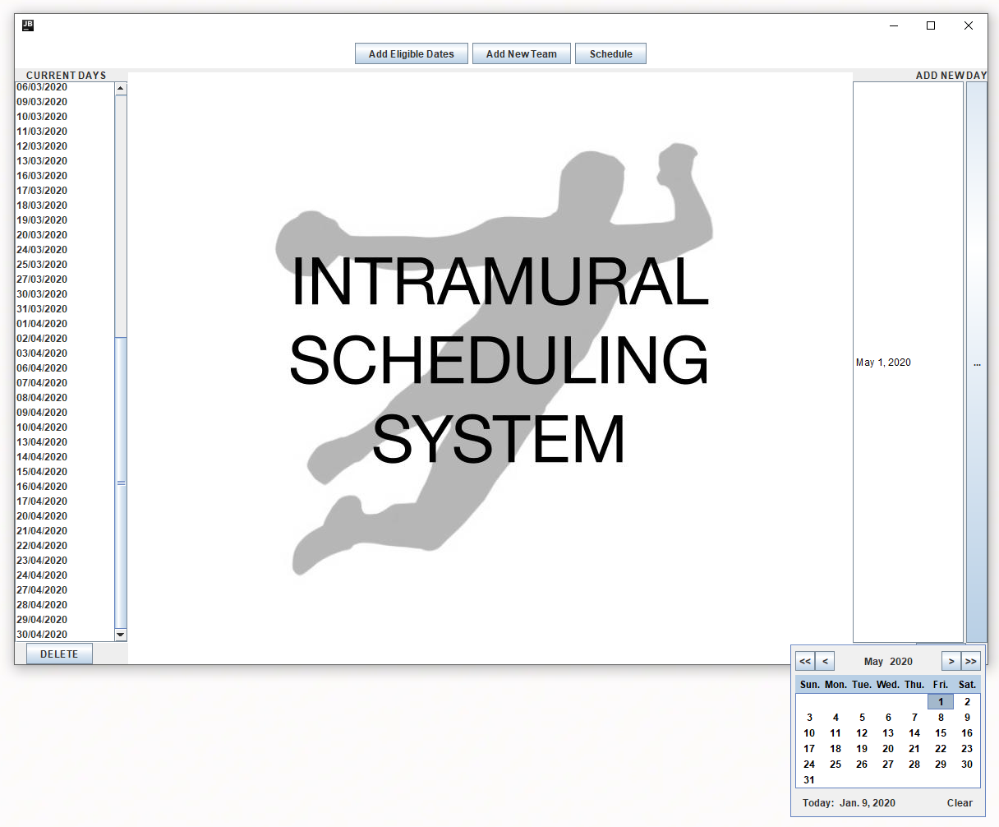
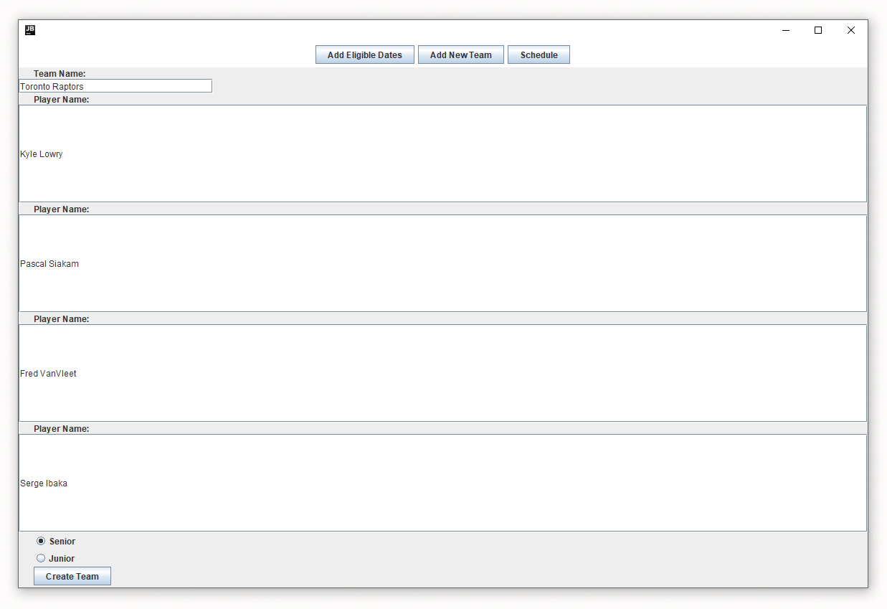
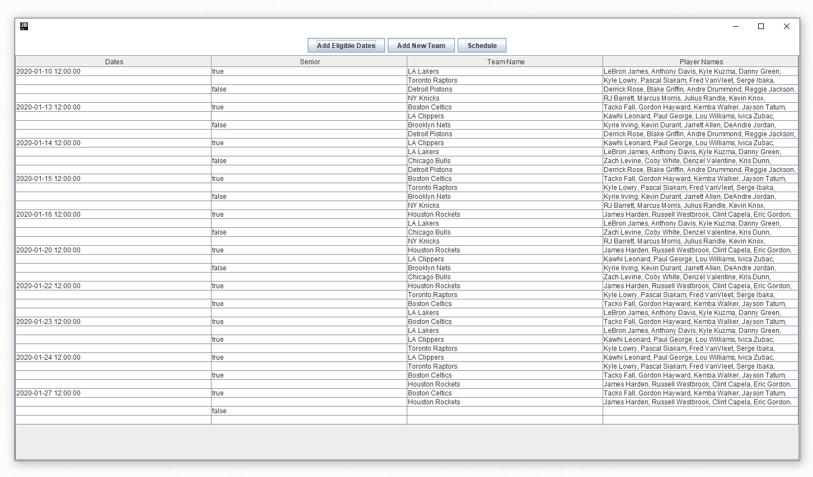

# Intramural Scheduling System

Intramural sports scheduling system for my school. SQLite database used for data. Java Swing used for GUI.

Date selection screen. Dates can be individually selected on the right and then are displayed on the left. Dates can also be individually deleted on the left.

Calendar that opens up when the ADD button is clicked.

Adding teams screen. Radio buttons for whether you want the team to be junior (grades 8 and 9) or senior (grades 10, 11, and 12).

Schedule automatically created with the dates and teams inputted. One senior and one junior a game every day until either league is exhausted and then the schedule continues with either two senior or two junior games a day (given no team conflicts — any given team cannot play twice in the same day). The issue of team conflicts is mitigated with a sorting algorithm meant to disperse teams throughout the order of games.
