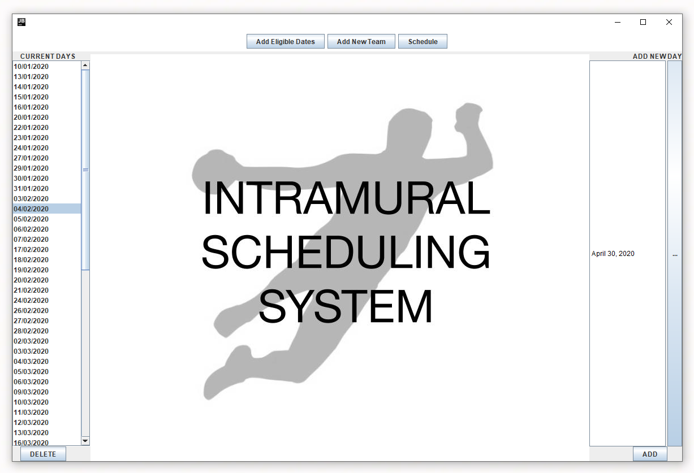
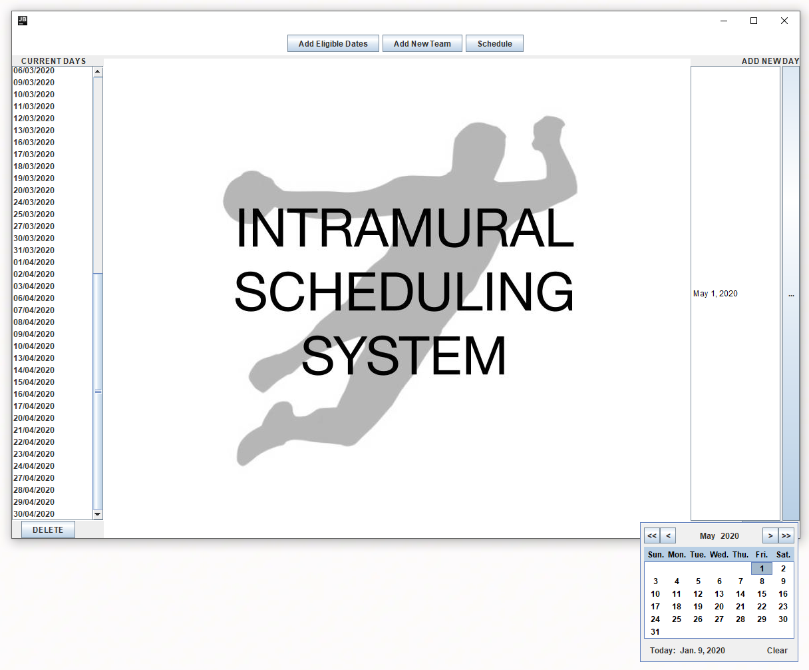
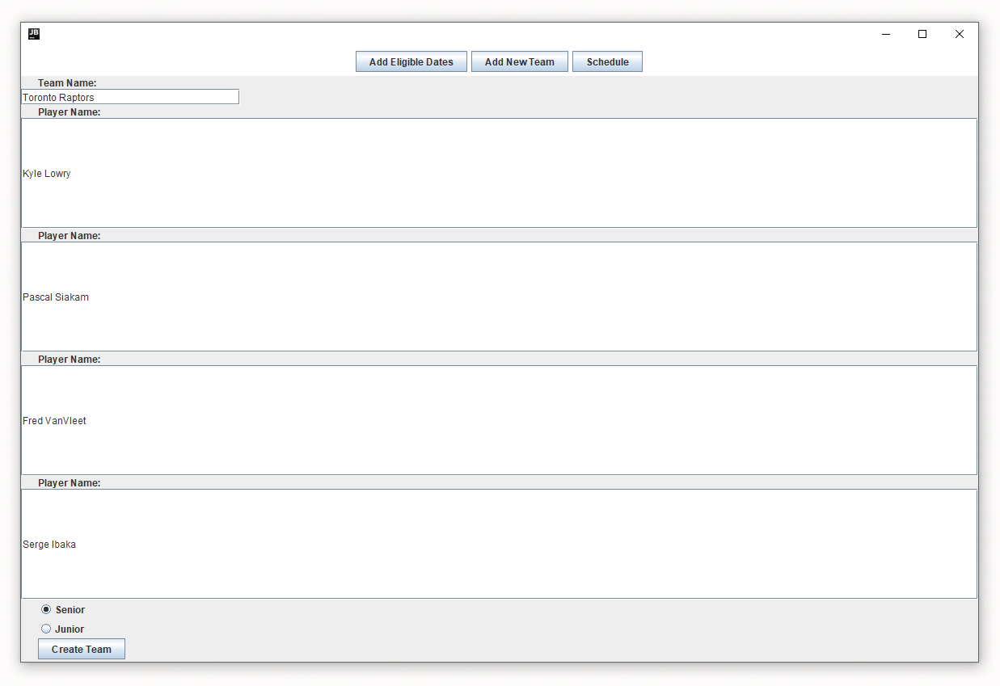
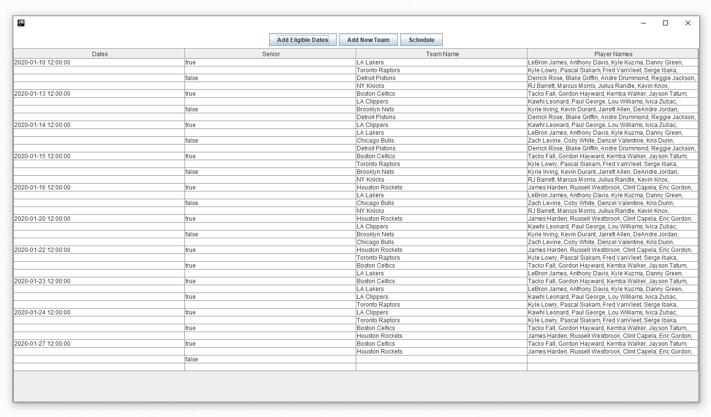

# Intramural Scheduling System

## Technical Overview
Intramural sports scheduling application for high schools. The application uses The Data Access Object (DAO) pattern to isolate the application/business layer from the persistence layer implemented with a SQLite database. Java Swing is used for the Graphical User Interface (GUI).

## User Experience

Date selection screen. Dates can be individually selected on the right and are then displayed in a scrollable list on the left. Dates can also be individually deleted on the left.

Calendar that opens up when the "ADD" button is clicked to select a new date.

Adding teams screen includes text boxes for inputting team and player names. It also includes radio buttons to select whether you want the team to be junior (grades 8 and 9) or senior (grades 10, 11, and 12).

The schedule is automatically created based on the inputted dates and teams. Eacxh game day has one senior and one junior game until either league is exhausted and then the schedule continues with either two senior or two junior games a day (given no team conflicts — any given team cannot play twice in the same day). The issue of team conflicts is mitigated with a sorting algorithm meant to disperse teams throughout the order of games.
